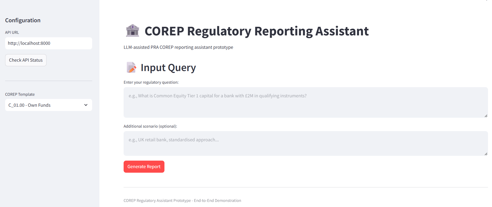
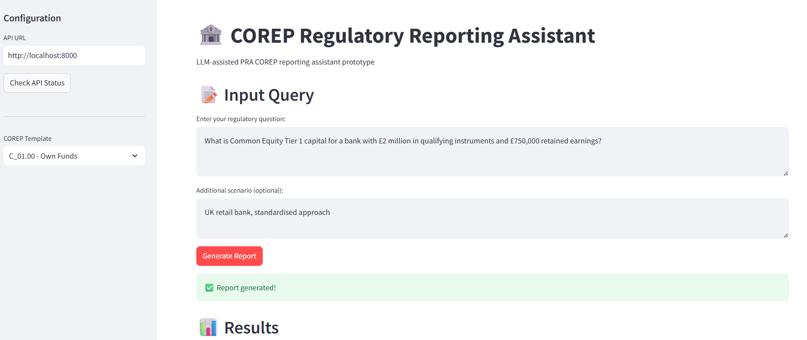
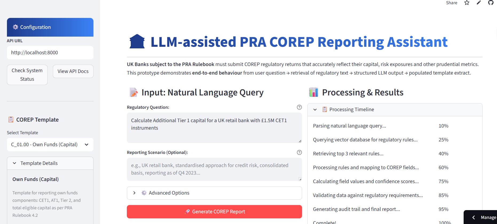
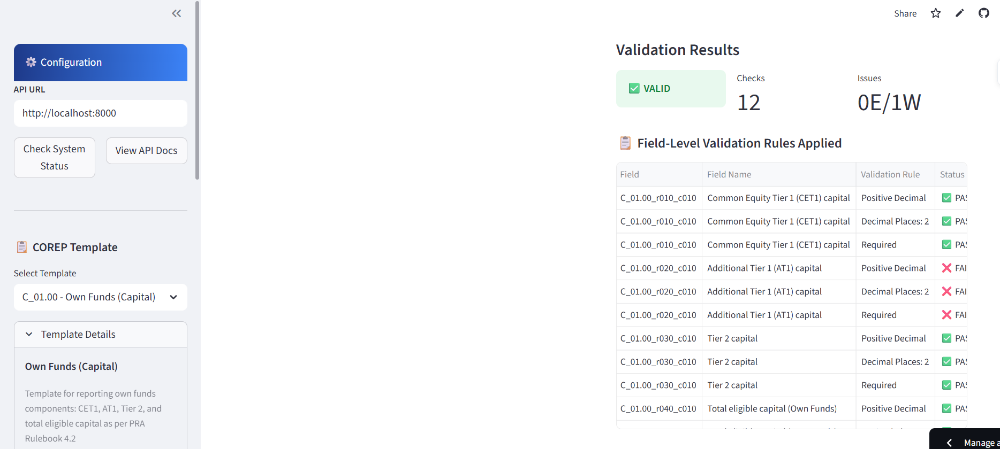
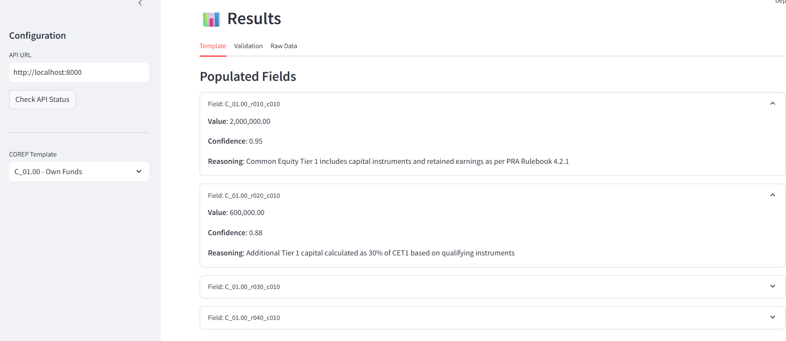
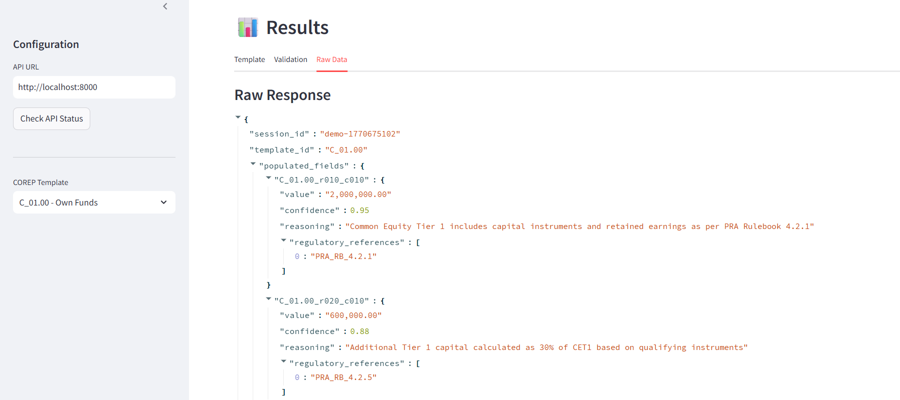
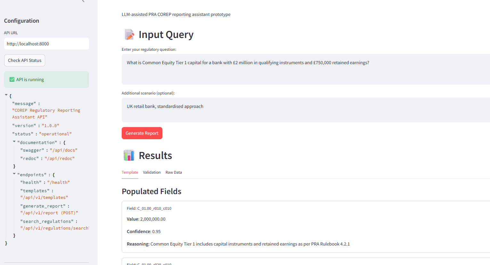

# COREP Regulatory Assistant
 ### An LLM-assisted regulatory reporting system for UK banks that converts natural language queries into structured COREP reports with complete audit trails.
 The prototype focuses on a **small, well-scoped subset of COREP** (Own Funds – C 01.00) to show **end-to-end feasibility**, not full regulatory coverage.

---
## LIVE URL
### Backend url- https://corep-assistant-dwee.onrender.com/
### Frontend url- https://corep-assistant-2.streamlit.app/
###  Problem Statement

NOTE- Visit the backend url first in order for frontend to work

Preparing COREP regulatory returns is complex and error-prone due to:

- Dense PRA Rulebook and COREP instructions  
- Manual interpretation of regulatory text  
- Mapping rules to structured COREP templates  

This system assists analysts by retrieving relevant regulatory text and generating **schema-bound COREP outputs** with traceable justifications.

---

##  What This Prototype Demonstrates

- Natural-language query input  
- Retrieval of relevant PRA / COREP regulatory text (RAG)  
- LLM constrained to **structured COREP-aligned JSON output**  
- Mapping to a COREP template extract (C 01.00)  
- Basic regulatory validation checks  
- Audit log linking reported fields to regulatory rules  

> ⚠️ This is **not a chatbot** and **not a production reporting engine**.

---
## How to Execute
```bash
Step 1: Clone the Repository**
bash
git clone https://github.com/yourusername/corep-regulatory-assistant.git
cd corep-regulatory-assistant
```

### **Step 2: Create Virtual Environment**
```bash
# Windows
python -m venv venv
venv\Scripts\activate
```

### **Step 3: Install Dependencies**
```bash
pip install -r requirements.txt
```

### **Step 4: Initialize the System**
```bash
python scripts/init_database.py

**Expected Output:**
[OK] Created directory: data
[OK] Created directory: logs
[OK] Loaded 4 own funds rules
[OK] Loaded 2 capital requirements rules
[OK] Vector database initialized with 6 regulatory texts
[OK] SQL database initialized with 6 regulatory texts
[SUCCESS] Initialization completed!

```

### **Step 5: Run the Application** 

 **Terminal 1 - Backend API:**
```bash
uvicorn src.main:app --reload --host 0.0.0.0 --port 8000
```

**Terminal 2 - Frontend:**
```bash
streamlit run frontend/app.py

```


## **📸 Screenshots**

 
 


 
 
 


